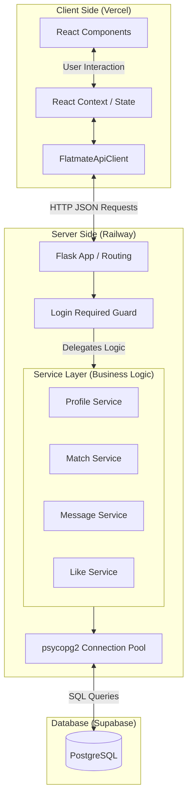

# Flatmate Finder

A web app that helps students and young professionals find compatible flatmates based on lifestyle preferences, budget, and living habits.

**Deployed app**:  

**Demo Video**: [demo video](https://youtu.be/SXHQTnzN03E)

## Problem Statement

Students and young professionals often struggle to find compatible flatmates through existing channels such as Facebook groups or generic housing platforms. These spaces are fragmented, hard to filter, and focus mostly on the room rather than the person — leading to mismatched lifestyles, wasted time, and uncomfortable living situations.

Flatmate Finder is a structured, profile-driven platform that helps users quickly identify and connect with potential flatmates based on compatibility factors like budget, habits, and preferences.

## Tech Stack & Architecture

| Layer | Technology |
|-------|-----------|
| Frontend | React 18 (Create React App) |
| Styling | Bootstrap 5 + custom CSS |
| Backend | Flask (Python) |
| Database | PostgreSQL |

### Architecture Diagram



*Separation of Concerns:* The application isolates UI/UX code in React components, HTTP/Routing in Flask (`app.py`), Business Logic in the Python `services/` directory, and Data persistence in PostgreSQL.

## Getting Started

### Prerequisites

- Node.js 18+
- Python 3.10+
- A PostgreSQL database (Supabase or local)

### Installation

```bash
git clone https://github.com/ganbnuray/flatmate-finder.git
cd flatmate-finder
```

Copy `.env.example` to `.env` and fill in your `DATABASE_URL`:

```bash
cp .env.example .env
```

### Running

```bash
./dev-start.sh
```

The script installs dependencies, then starts the backend and frontend. Open [http://localhost:3000](http://localhost:3000) in your browser.

### Running with Docker (reproducible demo)

For a fully containerized setup with no host Python, Node, or Postgres required:

```bash
docker compose up --build
```

Open [http://localhost:3000](http://localhost:3000). The stack includes Postgres (initialized from `db/schema.sql` on first run), the Flask backend served by gunicorn, and the React build served by nginx which also proxies API calls to the backend.

To stop: `Ctrl+C`, then `docker compose down`.

To reset the database (wipe the `pgdata` volume and re-run `schema.sql` on next start):

```bash
docker compose down -v
```

This mode is for reproducible demos and onboarding. For daily development with hot reload, keep using `./dev-start.sh`. Do not run both at the same time, they both bind host port 3000.

## Running Tests

Tests require Docker to be running. They use [testcontainers](https://testcontainers-python.readthedocs.io/) to spin up a disposable PostgreSQL database, so they never touch the production database.

```bash
cd backend
pip install -r requirements-dev.txt
pytest
```

## Development Workflow

This project follows **GitHub Flow**. Please read [CONTRIBUTING.md](CONTRIBUTING.md) before making any changes.

### Branch Naming Convention

| Type | Pattern | Example |
|------|---------|---------|
| Feature | `feature/<short-description>` | `feature/user-profile-page` |
| Bug fix | `fix/<short-description>` | `fix/login-redirect` |
| Setup/config | `setup/<short-description>` | `setup/ci-pipeline` |
| Documentation | `docs/<short-description>` | `docs/api-endpoints` |

### Continuous Integration

Every push and pull request runs two parallel jobs defined in `.github/workflows/ci.yaml`: `backend-test` runs the pytest suite against a testcontainers-managed PostgreSQL instance; `frontend-test` runs `npm test` with Jest. Both jobs target `ubuntu-latest`, which ships with Docker preinstalled (required by testcontainers). Failing tests block the workflow run.

## Team

| Member | Role |
|--------|------|
| Nuray | BE/DB |
| Ahmed | BE/DB |
| Karolina | FE+UI/UX |
| James | FE+UI/UX |
| Aru | FE+UI/UX |
| Dasha | PM |

## License

This project is developed as part of the CS162 course at Minerva University.
